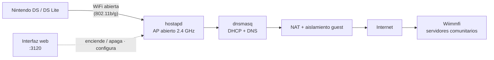

<div align="center">


# ds-wifi

**Punto de acceso WiFi para Nintendo DS / DS Lite, con control total de la red desde el celular.** Crea una red compatible con la DS (abierta o WEP) para que tu consola se conecte. Llegar a [Wiimmfi](https://wiimmfi.de) u otros servidores es decisión tuya: se hace configurando el DNS en la propia DS.

[![License][license-badge]](LICENSE)

[Instalación](#instalación) · [Cómo funciona](#cómo-funciona) · [Conectar una DS](#conectar-una-nintendo-ds-lite) · [Configuración](#configuración)


</div>

---

## Problema

La Nintendo DS / DS Lite solo soporta WiFi **802.11b** con seguridad **abierta o WEP** (no WPA/WPA2). Configurar un router para eso es tedioso y arriesgado: hay que bajar la seguridad, jugar con el firmware y, al terminar, revertir todo. Sin interfaz se puede, pero es incómodo y propenso a errores.

`ds-wifi` resuelve eso con un punto de acceso dedicado y una **interfaz web** desde la que controlas la red: la enciendes cuando juegas, la apagas cuando terminas, y ajustas SSID, filtro MAC, DHCP y aislamiento sin tocar el router.

> **Sobre Wiimmfi**: son **servidores comunitarios** (hechos por fans) que reemplazan a Nintendo WFC. `ds-wifi` **no te conecta a Wiimmfi** ni está afiliado a ellos: solo crea la red WiFi. La conexión a esos servidores (o a cualquier otro) la decides tú, configurando el DNS en tu DS.

## Solución

- **Red abierta + filtro por MAC** — solo las consolas listadas pueden asociarse.
- **Aislamiento guest** — los clientes salen a internet pero no alcanzan tu LAN.
- **Apagada por defecto** — la red solo existe mientras la enciendes.
- **Interfaz web** — encender/apagar, clientes conectados, logs en vivo y configuración completa desde el celular o PC.

## Instalación

Requisitos: Ubuntu 24.04 (o derivado con `systemd` e `iptables`), una tarjeta WiFi que soporte modo AP en 2.4 GHz (`iw list` debe listar `AP`) y conexión a internet por cable.

```bash
git clone https://github.com/felipesuarez-dev/ds-wifi.git
cd ds-wifi
sudo ./install.sh
```

El instalador instala los paquetes (`hostapd`, `dnsmasq`, `iw`, `node`), crea el usuario `dswifi`, detecta las interfaces WiFi y LAN, copia todo a `/opt/ds-wifi` y arranca el servicio web.

Abre **http://&lt;IP-del-servidor&gt;:3120**.

## Cómo funciona



La interfaz web corre como usuario `dswifi` con sudo acotado (solo puede arrancar/parar el AP y leer estado/logs). El AP, el NAT y el firewall corren como root dentro de `ds-wifi-ap.service`.

## Conectar una Nintendo DS Lite

1. **Obtén la MAC**: inserta un juego con WFC (Mario Kart DS, etc.) → `NINTENDO WFC` → `Nintendo WFC Settings` → `Options` → `System Information`. El **Nintendo WFC ID** es la MAC (12 caracteres hex).
2. En la interfaz web: **Configuración → Acceso (filtro MAC)** → agrega la MAC con dos puntos (`00:1F:2B:3C:4D:5E`) → **Guardar**.
3. Enciende la red con el botón.
4. En la DS: `Ajustes de conexión de Nintendo Wi-Fi` → `Buscar un punto de acceso` → elige `NDSWFC` (sin candado).
5. `Cambiar ajustes` → DNS manual:
   - **Primario:** `178.62.43.212` (Kaeru → Wiimmfi)
   - **Secundario:** `1.1.1.1`
6. `Probar conexión`. Listo.

> Algunos juegos que usan SSL necesitan el parche NoSSL (WfcPatcher). La mayoría de los juegos grandes funcionan solo con el DNS.

## Configuración

Todo se configura desde la interfaz web:

| Sección | Opciones |
|---|---|
| Red inalámbrica | SSID, seguridad (abierta/WEP), canal, país, ocultar SSID |
| Acceso | filtro MAC on/off + lista de MAC |
| Red/DHCP | IP del AP, subred, rango DHCP, lease time, DNS |
| Seguridad & auto | aislamiento guest, auto-apagado por inactividad, PIN |

## API

| Método | Ruta | Descripción |
|---|---|---|
| GET | `/api/status` | estado + clientes conectados |
| POST | `/api/toggle` | `{action: "on" \| "off"}` |
| GET | `/api/config` | configuración completa |
| POST | `/api/config` | guarda y aplica |
| POST/DELETE | `/api/whitelist` | agrega/quita MAC |
| GET | `/api/logs` | últimas líneas del log |

## Estructura

```
bin/ap-control.sh   # start/stop del AP (hostapd + dnsmasq + NAT + aislamiento)
bin/status.sh       # snapshot JSON de clientes
bin/log.sh          # lector de logs
web/server.js       # API + generación de configs (Node, sin dependencias)
web/public/         # interfaz web (HTML/CSS/JS vanilla)
config/ap.json      # config editable (no se versiona)
systemd/            # unidades ds-wifi-ap.service y ds-wifi-web.service
sudoers/dswifi      # permisos acotados para el usuario dswifi
```

## Notas

- La DS Lite se desconecta sola cuando no usa el modo online (suelta el lease DHCP); el contador de clientes refleja las consolas con lease activo.
- El SSID es visible para cualquiera en rango, pero solo las MAC listadas pueden asociarse. Si quieres que ni aparezca, activa "Ocultar SSID" (es cosmético; el filtro MAC es la protección real).
- La MAC se puede falsificar en teoría; el aislamiento guest hace que, incluso en ese caso, el cliente solo obtenga internet.

## Autor

<div align="center">


**[PumaSoft](https://github.com/felipesuarez-dev)**

</div>

## Licencia

MIT © 2026 — ver [LICENSE](LICENSE).

[license-badge]: https://img.shields.io/badge/license-MIT-a8d8a8?style=flat-square
