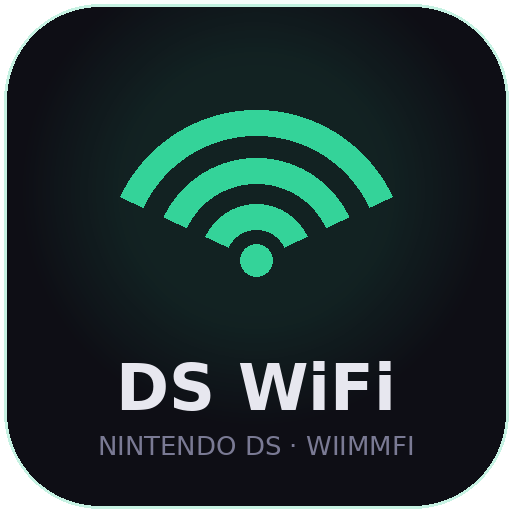
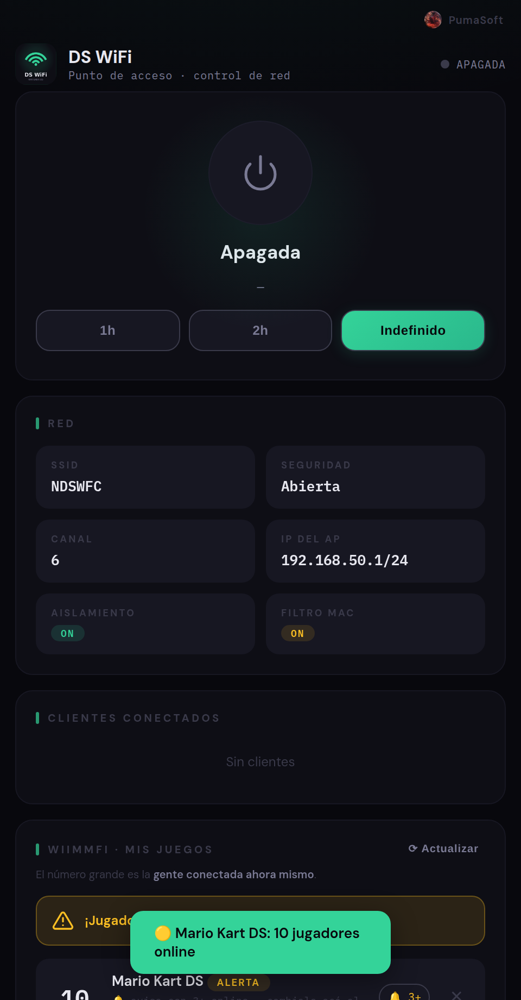
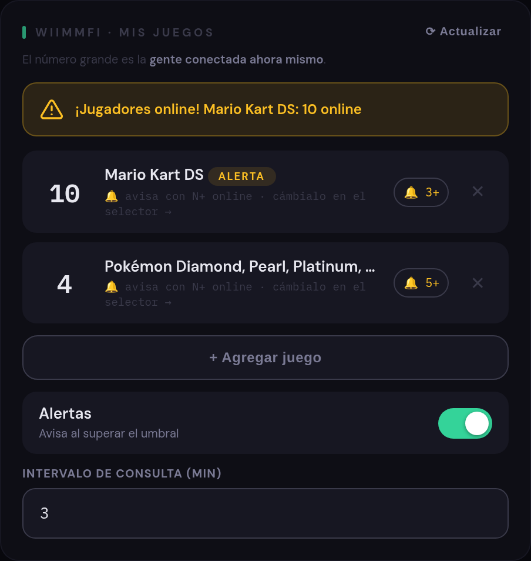
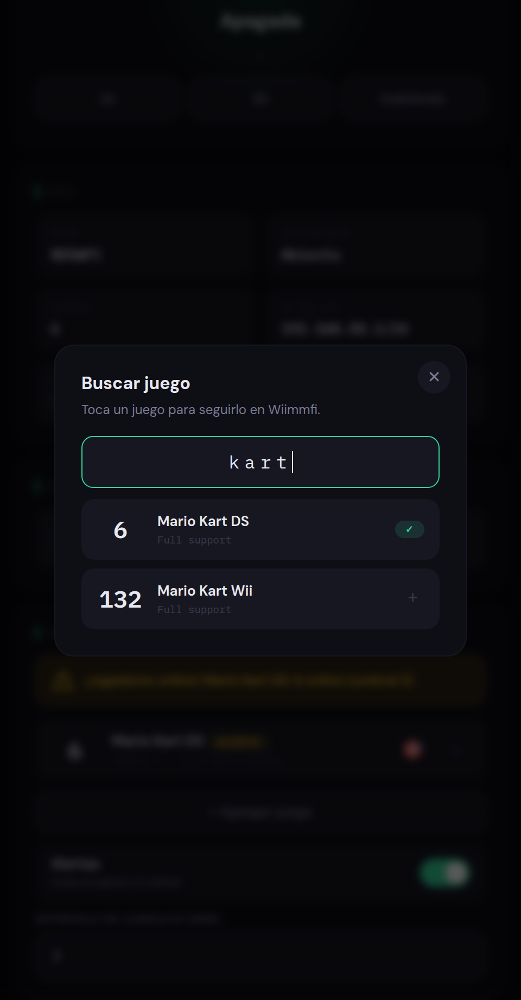
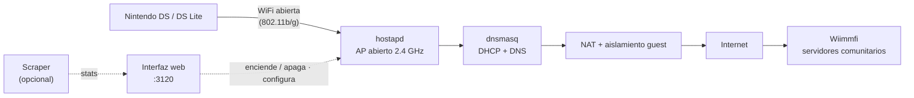

<div align="center">



# ds-wifi

**Punto de acceso WiFi para Nintendo DS / DS Lite, con control total de la red desde el celular.** Crea una red compatible con la DS (abierta o WEP) y te deja administrar dispositivos, ver quién está conectado y seguir los servidores comunitarios de [Wiimmfi](https://wiimmfi.de) con alertas en vivo.

[![Version][version-badge]](#) [![Estado][status-badge]](#) [![Licencia][license-badge]](LICENSE) [![Bash][bash-badge]](#) [![Node.js][node-badge]](#)

[Instalación](#instalación) · [Cómo funciona](#cómo-funciona) · [Conectar una DS](#conectar-una-nintendo-ds-lite) · [Características](#características) · [Configuración](#configuración)



<table>
  <tr>
    <td width="50%"></td>
    <td width="50%"></td>
  </tr>
  <tr>
    <td align="center"><b>Mis juegos</b> — favoritos con jugadores online y alerta</td>
    <td align="center"><b>Selector</b> — buscá cualquier juego y seguílo</td>
  </tr>
</table>

</div>

---

## Problema

La Nintendo DS / DS Lite solo soporta WiFi **802.11b** con seguridad **abierta o WEP** (no WPA/WPA2). Configurar un router para eso es tedioso y arriesgado: hay que bajar la seguridad, jugar con el firmware y, al terminar, revertir todo. Sin interfaz se puede, pero es incómodo y propenso a errores.

`ds-wifi` resuelve eso con un punto de acceso dedicado y una **interfaz web** desde la que controlas la red: la enciendes cuando juegas, la apagas cuando terminas, y ajustas SSID, filtro MAC, DHCP y aislamiento sin tocar el router.

> **Sobre Wiimmfi**: son **servidores comunitarios** (hechos por fans) que reemplazan a Nintendo WFC. `ds-wifi` **no te conecta a Wiimmfi** ni está afiliado a ellos: solo crea la red WiFi. La conexión a esos servidores (o a cualquier otro) la decides tú, configurando el DNS en tu DS.

## Instalación

Requisitos: Ubuntu 24.04 (o derivado con `systemd` e `iptables`), una tarjeta WiFi que soporte modo AP en 2.4 GHz (`iw list` debe listar `AP`) y conexión a internet por cable.

```bash
git clone https://github.com/felipesuarez-dev/ds-wifi.git
cd ds-wifi
sudo ./install.sh
```

El instalador instala los paquetes (`hostapd`, `dnsmasq`, `iw`, `node`), crea el usuario `dswifi`, detecta las interfaces WiFi y LAN, copia todo a `/opt/ds-wifi` y arranca el servicio web.

Abre **http://&lt;IP-del-servidor&gt;:3120**.

### Scraper de Wiimmfi (opcional)

El contador de jugadores online usa un worker que lee `wiimmfi.de`:

```bash
sudo ./scraper/install.sh
```

El worker usa **nodriver + Google Chrome real** (headful bajo Xvfb), que es lo que pasa el reto de Cloudflare de `wiimmfi.de`. Cada pocos minutos descarga **el listado completo de juegos** (ID, nombre, estado y jugadores online) de una sola URL (`/stat?m=c`) y lo expone en la interfaz.

**No hay que pegar URLs ni cookies**: en "Wiimmfi · Mis juegos" buscas el juego que te interesa, lo agregas a tus favoritos y eliges el umbral de alerta. Todo dinámico.

> Requiere Google Chrome instalado (el instalador lo baja automáticamente) y usa ~300 MB de RAM por el navegador.

## Cómo funciona



La interfaz web corre como usuario `dswifi` con sudo acotado (solo puede arrancar/parar el AP y leer estado/logs). El AP, el NAT y el firewall corren como root dentro de `ds-wifi-ap.service`. El scraper (opcional) corre como servicio aparte y escribe los datos que la UI lee.

## Conectar una Nintendo DS Lite

1. **Obtén la MAC**: inserta un juego con WFC (Mario Kart DS, etc.) → `NINTENDO WFC` → `Nintendo WFC Settings` → `Options` → `System Information`. El **Nintendo WFC ID** es la MAC (12 caracteres hex).
2. En la interfaz web: **Configuración → Acceso (dispositivos)** → escribe la MAC en las 6 cajas (los dos puntos se agregan solos) → **Agregar dispositivo** → **Guardar**.
3. Enciende la red con el botón.
4. En la DS: `Ajustes de conexión de Nintendo Wi-Fi` → `Buscar un punto de acceso` → elige el SSID (sin candado).
5. `Cambiar ajustes` → DNS manual:
   - **Primario:** `178.62.43.212` (Kaeru → Wiimmfi)
   - **Secundario:** `1.1.1.1`
6. `Probar conexión`. Listo.

> Algunos juegos que usan SSL necesitan el parche NoSSL (WfcPatcher). La mayoría de los juegos grandes funcionan solo con el DNS.

## Características

| Área | Qué hace |
|---|---|
| **Encendido/apagado** | Botón grande + temporizador (1h / 2h / indefinido) y auto-apagado por inactividad |
| **Dispositivos** | Whitelist por MAC con ingreso segmentado (6 cajas), nombre personalizado, copiar MAC, exportar/importar JSON y detección de fabricante (OUI) |
| **Estado en vivo** | Punto verde en los dispositivos conectados + aviso "se conectó" |
| **Clientes** | Lista de conectados con IP, señal (dBm) y nombre amigable |
| **Wiimmfi · Mis juegos** | Listado dinámico de juegos con jugadores online, buscador, favoritos y **alertas en vivo** con umbral configurable (notificación del navegador) |
| **Ayuda** | Guía de conexión integrada + diagnóstico de red (internet / Wiimmfi) |
| **Red** | SSID, seguridad (abierta/WEP), canal, país, ocultar SSID, filtro MAC |
| **DHCP** | IP del AP, subred, rango DHCP, lease time, DNS |
| **Seguridad** | Aislamiento guest (la DS no toca tu LAN), PIN de acceso |
| **Logs** | Registro en vivo del AP (colapsado por defecto) |

## Configuración

Todo se configura desde la interfaz web:

| Sección | Opciones |
|---|---|
| Red inalámbrica | SSID, seguridad (abierta/WEP), canal, país, ocultar SSID |
| Acceso (dispositivos) | filtro MAC on/off, lista con nombres, exportar/importar |
| Red/DHCP | IP del AP, subred, rango DHCP, lease time, DNS |
| Seguridad & auto | aislamiento guest, auto-apagado, PIN |
| Wiimmfi · Mis juegos | buscador de juegos, favoritos, umbral de alerta, intervalo |

## API

| Método | Ruta | Descripción |
|---|---|---|
| GET | `/api/status` | estado + clientes conectados |
| POST | `/api/toggle` | `{action: "on" \| "off"}` |
| GET | `/api/config` | configuración completa |
| POST | `/api/config` | guarda y aplica |
| POST/DELETE/PUT | `/api/whitelist` | agrega / quita / renombra MAC |
| GET/POST | `/api/whitelist/export·import` | respaldo y restauración |
| GET | `/api/stats` | favoritos con jugadores online + estado de alerta |
| GET | `/api/games` | listado de juegos (con `?q=` para buscar) |
| GET | `/api/diag` | diagnóstico de internet / Wiimmfi |
| GET | `/api/logs` | últimas líneas del log |

## Estructura

```
bin/ap-control.sh      # start/stop del AP (hostapd + dnsmasq + NAT + aislamiento)
bin/status.sh          # snapshot JSON de clientes
bin/log.sh             # lector de logs
scraper/scraper.py     # worker opcional (nodriver + Chrome real) para stats de Wiimmfi
web/server.js          # API + generación de configs (Node, sin dependencias)
web/public/            # interfaz web (HTML/CSS/JS vanilla)
config/ap.json         # config editable (no se versiona)
systemd/               # unidades ds-wifi-{ap,web,scraper}.service
sudoers/dswifi         # permisos acotados para el usuario dswifi
```

## Notas

- La DS Lite se desconecta sola cuando no usa el modo online (suelta el lease DHCP); el contador refleja las consolas con lease activo.
- El SSID es visible para cualquiera en rango, pero solo las MAC listadas pueden asociarse. "Ocultar SSID" es cosmético; el filtro MAC es la protección real.
- La MAC se puede falsificar en teoría; el aislamiento guest hace que, incluso en ese caso, el cliente solo obtenga internet.
- Para publicar una versión nueva, sigue `docs/RELEASING.md`.

## Autor

<div align="center">


**[PumaSoft](https://github.com/felipesuarez-dev)**

</div>

## Licencia

MIT © 2026 — ver [LICENSE](LICENSE).

[version-badge]: https://img.shields.io/badge/versi%C3%B3n-0.2.2-34d399?style=flat-square
[status-badge]: https://img.shields.io/badge/estado-Beta-fbbf24?style=flat-square
[license-badge]: https://img.shields.io/badge/licencia-MIT-a8d8a8?style=flat-square
[bash-badge]: https://img.shields.io/badge/bash-4EAA25?style=flat-square&logo=gnubash&logoColor=white
[node-badge]: https://img.shields.io/badge/node.js-339933?style=flat-square&logo=nodedotjs&logoColor=white
